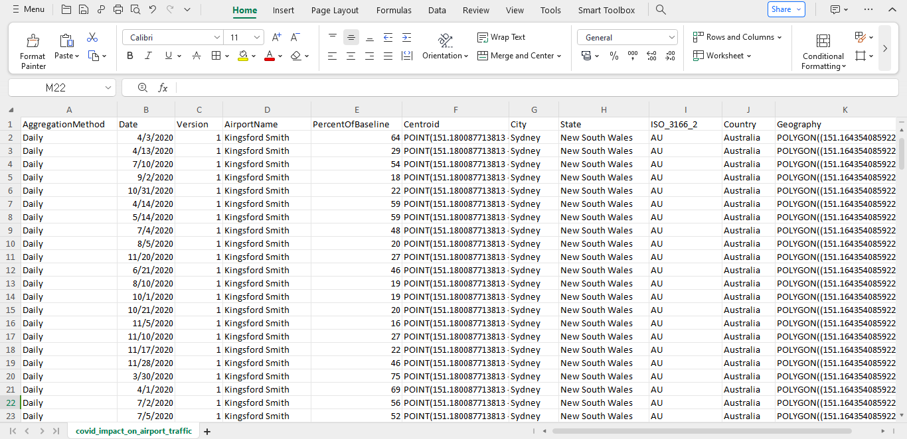
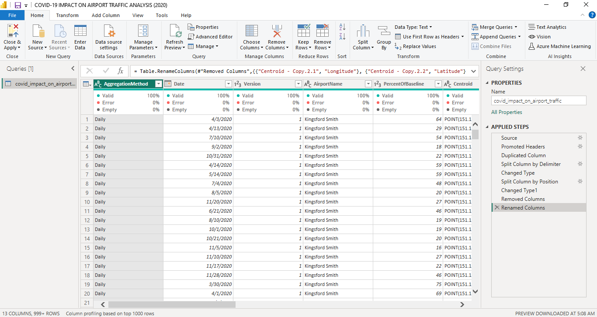

# Covid-19-Impact-on-Airline-Traffic-Analysis-(2020)

## Project Overview
### Introduction:
The outbreak of the Covid-19 pandemic in 2020 led to unprecedented disruptions across various sectors, with the airline industry being one of the hardest-hit. This project aims to analyze the impact of the Covid-19 pandemic on global airline traffic patterns during the year 2020. By leveraging data analysis techniques, we seek to gain insights into how travel restrictions, lockdown measures, and public health concerns affected air travel behavior worldwide.

### Problem Statement:
The outbreak of the Covid-19 pandemic in 2020 has severely impacted the global airline industry, leading to unprecedented disruptions in air travel patterns. As countries implemented various containment measures, including travel restrictions and lockdowns, airline traffic experienced significant fluctuations, with profound implications for airlines, airports, and related stakeholders. However, there remains a critical need to systematically analyze the extent and nature of these disruptions, understand the underlying factors driving changes in airline traffic behavior, and identify actionable insights to inform future strategies and policies.

This project seeks to address the following key questions:

- What is the total flight recorded for this analysis?
- What is the total traffic impact?
- What is the average percent of baseline?
- What is the total flights recorded by Country?
- What is the number of Airports, Countries and Cities in this analysis?
- What is the overall traffic impact by Country? Use a chart.
- With the help of a chart, display the flights trend monthly was recorded within the period of this analysis?
- Using a chart, show the contributions of different Airports to the overall traffic impact?
- Using geospatial mapping, showcase the percentage of baseline by Airport, Country, Stae and City?
- What actionable insights can be derived from the analysis to assist stakeholders in the aviation industry and policymakers in adapting strategies and mitigating future risks associated with similar crises?

### Expected Outcomes:

- Total Flight Recorded: The analysis will provide the total number of flights recorded within the specified period, offering a comprehensive view of the scale of air traffic during the time frame under consideration.

- Total Traffic Impact: By comparing pre-pandemic levels of air traffic with those during the pandemic period, the analysis will quantify the total impact on air traffic, providing insights into the severity of disruptions experienced by the airline industry.

- Average Percent of Baseline: Calculating the average percentage of baseline traffic will offer a standardized measure to gauge the overall reduction in air travel activity relative to pre-pandemic levels.

- Total Flights Recorded by Country: This outcome will present a breakdown of the total number of flights recorded for each country, enabling a comparative analysis of the impact across different regions.

- Number of Airports, Countries, and Cities: Providing counts of airports, countries, and cities included in the analysis will offer contextual information about the scope and geographic coverage of the dataset.

- Overall Traffic Impact by Country (Chart): A chart depicting the overall traffic impact by country will visually illustrate the varying degrees of disruption experienced across different countries.

- Monthly Flight Trend (Chart): Visualizing the monthly flight trend will enable stakeholders to identify temporal patterns and fluctuations in air travel activity over the course of the analysis period.

- Contributions of Different Airports (Chart): Displaying the contributions of different airports to the overall traffic impact will highlight the relative importance of various air transportation hubs in shaping the overall traffic patterns.

- Geospatial Mapping of Baseline Percentage: Using geospatial mapping, the analysis will showcase the percentage of baseline traffic by airport, country, state, and city, offering a spatial perspective on the distribution of air traffic disruptions.

- Actionable Insights: Drawing from the analysis results, actionable insights will be derived to assist stakeholders in the aviation industry and policymakers in adapting strategies and mitigating future risks associated with similar crises. These insights may include recommendations for route optimization, capacity planning, health and safety protocols, policy adjustments, and crisis management strategies.

### About The Dataset
This dataset shows traffic to and from the Airport as a Percentage of the Traffic volume during the baseline period. The baseline period used for computing this metric is from 1st Feb to 15th March 2020. The dataset gets updated monthly. This data is publicly available from [Geotab](https://www.geotab.com/). The dataset is in .csv file and can be viewed or downloaded [here](covid_impact_on_airport_traffic.csv)

The dataset is made up of 11 columns and 7,248 rows of data. Here is a breakdown of the column details:

- AggregationMethod: This column indicates the method used for aggregating or summarizing the data. Here, the data is aggregated on a daily basis.
  
- Date: This column represents the date for which the data is recorded. It typically follows a standardized date format (e.g., YYYY-MM-DD) and indicates the specific time point or period to which each data entry corresponds.

- Version: This column denotes the version or iteration of the dataset. It may indicate updates, revisions, or modifications made to the dataset over time, allowing users to track changes and ensure data integrity.

- AirportName: This column contains the name or identifier of the airport associated with each data entry. It identifies the specific airport location to which the data pertains, facilitating analysis and interpretation based on geographic context.

- PercentOfBaseline: This column provides a measure of the percentage deviation from a baseline value. In the context of airline traffic data, it represents the percentage of normal or pre-pandemic levels of air traffic for each observation, indicating the extent of disruption or recovery in air travel activity.

- Centroid: This column contain geographical coordinates (latitude and longitude) representing the central point or centroid of the airport location. It enables spatial analysis and visualization, allowing users to map and analyze data based on airport locations.

- City: This column specifies the city or urban area associated with each airport. It provides additional geographic information to complement the airport name, helping users identify the location of airports within specific cities or metropolitan areas.

- State: This column indicates the state or province (if applicable) where the airport is located. It further refines the geographical context of each airport, particularly in countries with administrative divisions such as the United States, Canada, or Australia.

- ISO_3166_2: This column contain the ISO 3166-2 code corresponding to the state or province where the airport is located. ISO 3166-2 is a standardized coding system used to represent country subdivisions, facilitating data interoperability and cross-referencing with other datasets.

- Country: This column specifies the country where the airport is situated. It provides the highest level of geographical context for each data entry, enabling analysis and comparison of data across different countries or regions.

- Geography: This column contain additional geographical information or descriptors related to each airport location. It could include details such as geographical regions, continents, or other spatial attributes that help classify and organize airport locations within a broader geographic framework.

### Tools Used
1. Power Query Editor
    - Was used to:
        1. Extract,
        2. Transform, and
        3. Load all the datasets for this analysis.
           
2. Power BI (Was used to create reports and dashboard for this analysis)
    - The following Power BI Features were incorporated:
        1. DAX,
        2. Quick Measures,
        3. Page Navigation,
        4. Filters,
        5. Tooltips

### ETL Process using the Power Query Editor:
1. Ttranslated all the colume headers in Swedish language to English for easy understanding
2. Duplicated the Centroid column into 2 more columns: "Centroid 1" and "Centroid 2"
3. Split the duplicated Centroid columns by delimeter.
4. Split the duplicated Centroid columns by position.
5. Changed the Centroid 1 and Centroid 2 datra types to 'text'.
6. Changed their column names to Longitude and Latitude.
7. Changed the Date column type to 'date'.
8. Made sure there is no null values or missing data.

**Raw Data**

**Final query editor screenshot**

## Visuals in Power BI:
_Dashboard.jpg)

