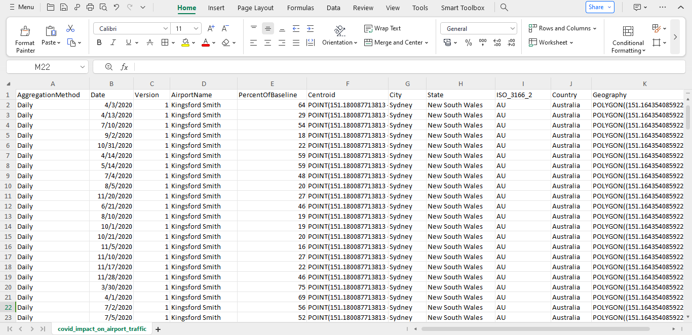
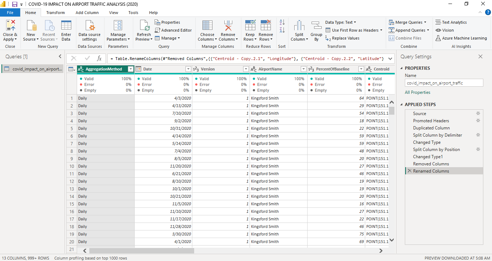
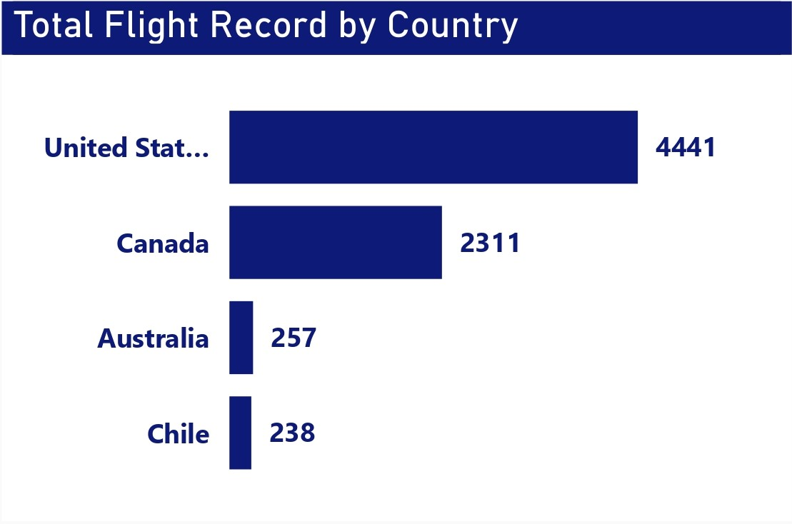
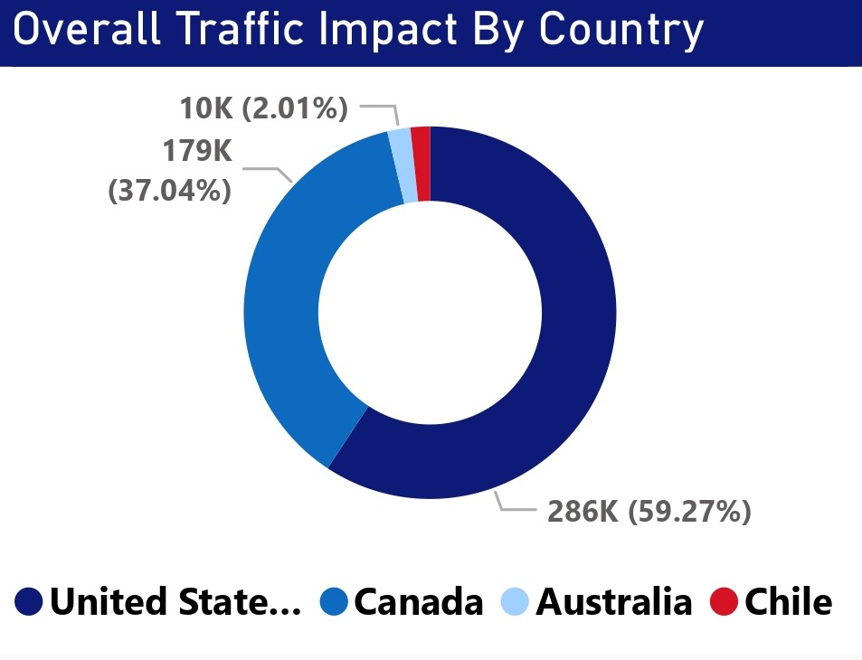
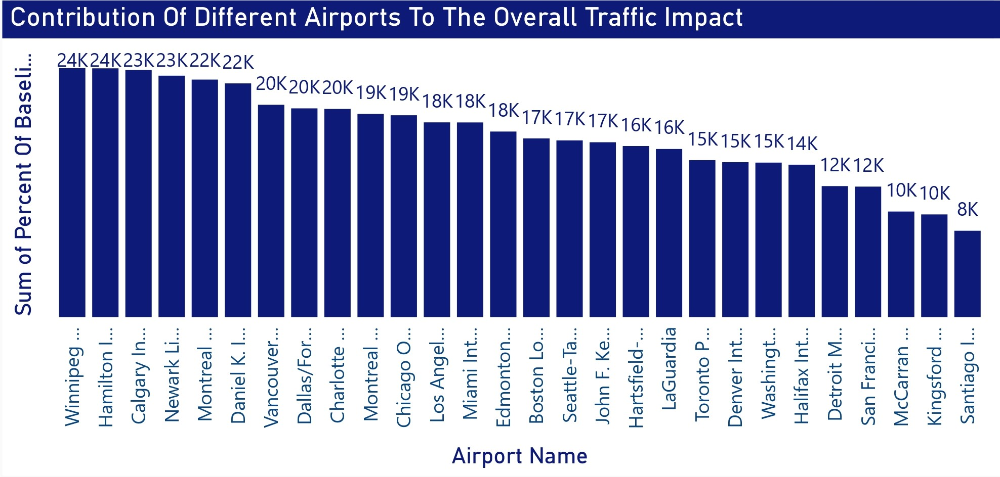

# Covid-19 Impact On Airline Traffic (2020) Analysis

 

## Table of Contents
- [Project Overview](#project-overview)
- [About The Dataset](#about-the-dataset)
- [Tools Used](#tools-used)
- [Visuals in Power BI:](#visuals-in-power-bi)
- [View and Interact With Power BI Dashboard Report](#view-and-interact-with-power-bi-dashboard-report)
- [Recommendations on How To Mitigate or Control the Impact of Pandemics on Airport Traffic](#recommendations-on-how-to-mitigate-or-control-the-Impact-of-pandemics-on-airport-traffic)
 

## Project Overview
### Introduction:
In 2020, the Covid-19 outbreak caused disruptions that had never occurred before in many industries; the airline industry was among the most affected. This analysis thus embarks on establishing how air traffic patterns were affected globally by the Covid-19 pandemic in 2020. We intend to use data analysis techniques to understand how travel restrictions, lockdown rules, and fear of illness mediated air travel behavior in some particluar countries of the world. 

### Problem Statement:
The Covid-19 pandemic that detonated in 2020 has served as a sledgehammer blow to the global airline industry and disrupted air travel patterns never seen before. Underpinned by some of the measures taken to contain it by nations globally, notably featuring travel restrictions and lockdowns, airline traffic has shown extreme fluctuations with profound implications for airlines, airports, and related stakeholders. There is still an urgent need to systematically review the extent and nature of these shocks, understand the underlying drivers or motivating factors of changes in airline traffic behavior, and identify actionable insights that can help inform future strategies and policy. The analysis project shall be undertaken in 4 countries: the United States of America, Canada, Australia, and Chile. 

This project seeks to address the following key questions:

- What is the total flight recorded for this analysis?
- What is the total traffic impact?
- What is the average percent of baseline?
- What is the total flights recorded by Country?
- What is the number of Airports, Countries and Cities in this analysis?
- What is the overall traffic impact by Country? Use a chart.
- With the help of a chart, display the flights trend monthly was recorded within the period of this analysis?
- Using a chart, show the contributions of different Airports to the overall traffic impact?
- Using geospatial mapping, showcase the percentage of baseline by Airport, Country, Stae and City?
- What actionable insights can be derived from the analysis to assist stakeholders in the aviation industry and policymakers in adapting strategies and mitigating future risks associated with similar crises?

### Expected Outcomes:

- Total Flight Recorded: It will display the total number of flights recorded within the time range, indicating the magnitude of air traffic during the period under consideration.
- Total Traffic Impact: This will quantify the impact on air traffic by comparing pre-pandemic levels of air traffic with those in the period of the pandemic. It is going to yield information about the size of the disruptions the airline industry has faced.
- Average Percent of Baseline: The average percentage of the baseline traffic will give a benchmark measure by which the reduction in general air travel activity, relative to pre-pandemic levels, can be estimated.
- Total Flights Recorded by Country: This result will include a country-wise total count of flights recorded so that the bearing in different regions could be compared.
- Number of Airports, Countries, and Cities: The counts of airports, countries, and cities included will make available context about the scope and geographical coverage of the dataset.
- Overall Traffic Impact by Country Chart: A chart on the overall effect of the traffic impact by country will give a pictorial representation of how different countries have been affected at varying degrees of disruption.
- Monthly Trend of Flights Chart: Plotting the monthly trend of flights will provide stakeholders with insight into temporal trends and ebbs in air travel activities throughout the analysis period.
- Contributions of Different Airports (Chart): Such charting will allow one to quickly deduce the various contributions of different airports to the total traffic impact, allowing for relative importance to be established concerning different air transport hubs in shaping the overall pattern of traffic.
- Geospatial Mapping of Percentage Baseline: The analysis will express, through geospatial mapping, the percentage of baseline traffic by airport, country, state, and city, thus providing a spatial dimension to air traffic disruptions.
- Actionable Insights: From the results of the analysis, actionable insights would be drawn to help the stakeholders in the aviation industry and policymakers adjust their strategies for mitigating future risks associated with similar crises. Actionable insights will include route optimization, capacity planning, health and safety protocols, adjustment in policy instruments, and crisis management strategies.
 
 

### About The Dataset
This dataset shows traffic to and from the Airport as a Percentage of the Traffic volume during the baseline period. The baseline period used for computing this metric is from 1st Feb to 15th March 2020. The dataset gets updated monthly. This data is publicly available from [Geotab](https://www.geotab.com/). The dataset is in .csv file and can be viewed [here](covid_impact_on_airport_traffic.csv)

The dataset is made up of 11 columns and 7,248 rows of data. Here is a breakdown of the field data dictionary:
| Table                              | Field                    | Description                            |            
|:-----------------------------------|:------------------------ |:-------------------------------------- |
|covid_impact_on_airport_traffic.csv | AggregationMethod        | This column indicates the method used for aggregating or summarizing the data. Here, the data is aggregated on a daily basis    |
|                                    | Date                     | This column represents the date for which the data is recorded. It typically follows a standardized date format (e.g., YYYY-MM-DD) and indicates the specific time point or period to which each data entry corresponds     |
|                                    | Version                  | This column denotes the version or iteration of the dataset. It may indicate updates, revisions, or modifications made to the dataset over time, allowing users to track changes and ensure data integrity         |
|                                    | AirportName              | This column contains the name or identifier of the airport associated with each data entry. It identifies the specific airport location to which the data pertains, facilitating analysis and interpretation based on geographic context         |
|                                    | PercentOfBaseline        | This column provides a measure of the percentage deviation from a baseline value. In the context of airline traffic data, it represents the percentage of normal or pre-pandemic levels of air traffic for each observation, indicating the extent of disruption or recovery in air travel activity.        |
|                                    | Centroid                 | This column contain geographical coordinates (latitude and longitude) representing the central point or centroid of the airport location. It enables spatial analysis and visualization, allowing users to map and analyze data based on airport locations         |
|                                    | City                     | This column specifies the city or urban area associated with each airport. It provides additional geographic information to complement the airport name, helping users identify the location of airports within specific cities or metropolitan areas.        |
|                                    | State                    | This column indicates the state or province (if applicable) where the airport is located. It further refines the geographical context of each airport, particularly in countries with administrative divisions such as the United States, Canada, or Australia         |
|                                    | ISO_3166_2               | This column contain the ISO 3166-2 code corresponding to the state or province where the airport is located. ISO 3166-2 is a standardized coding system used to represent country subdivisions, facilitating data interoperability and cross-referencing with other datasets       |
|                                    | Country                  | This column specifies the country where the airport is situated. It provides the highest level of geographical context for each data entry, enabling analysis and comparison of data across different countries or regions        |
|                                    | Geography                | This column contain additional geographical information or descriptors related to each airport location. It could include details such as geographical regions, continents, or other spatial attributes that help classify and organize airport locations within a broader geographic framework        |
 

### Skills Utilized
1. Data Cleaning
2. Data Visualiziation
3. Descriptive Analytics
4. Analytical and Critical Thinking
5. Problem Solving
6. Communication and Reporting
 
   
### Tools Used
1. Power Query Editor
    - Was used to:
        1. Clean,
        2. Transform the dataset for this analysis.
           
2. Power BI (Was used to create reports and dashboard for this analysis)
    - The following Power BI Features were incorporated:
        1. DAX,
        2. Quick Measures,
        3. Page Navigation,
        4. Filters,
        5. Tooltips
 

### ETL Process using the Power Query Editor:
1. Duplicated the Centroid column into 2 more columns: "Centroid 1" and "Centroid 2"
2. Split the duplicated Centroid columns by delimeter.
3. Split the duplicated Centroid columns by position.
4. Changed the Centroid 1 and Centroid 2 data types to 'text'.
5. Changed their column names to Longitude and Latitude.
7. Changed the Date column type to 'date'.
8. Made sure there is no null values or missing data.
9. Rearranged the columns.
 

**Raw Data**

Raw Data  Screenshot                                                          |                                
:----------------------------------------------------------------------------:|

 

**Final Power Query Editor screenshot**

Power Query Editor                                                        |                                
:----------------------------------------------------------------------------:|

 
 

## Visuals in Power BI:
_Dashboard.jpg)
 
 

#### Project Analysis:
From the analysis, i made the findings below:
- The Total Flight Record is __7,247__.
- The Average Percentage of Baseline is __66.65%__.
- The total number of Airports is __28__.
- The Total Traffic Impact is __483,000__.
- Total Number of Airport Countries in this analysis is __4__.
- While the Total Number of Airport Cities is __27__.
 
 

- 

- **Total Flight Record by Country:**
- Considering the total number of flights these 4 countries had recorded in this analysis, USA was the one with the most number of flights at 4,441, while Canada was the next with 2,311 flights. The next in line was Australia with 257, while Chile was the least with 238 flights. Obvious as it may also seem, there is a fact: these numbers have variations between them by country. Let us run a more detailed analysis about them:
   - USA and Canada have bigger populations compared to Australia and Chile; the former countries are also larger in terms of aviation industries, which inherently provides for more air travel activity regardless of the external circumstances.
   - International Hubs: Large hubs, such as New York and Los Angeles in the US, along with Toronto and Vancouver in Canada, turn into significant points for international travel. Thereafter, very heavy passenger traffic comes to have the potential for supporting a good number of flight connections and even increasing the total number of flights.
   - Economic activity and Business Travel: Most of the Multinational Corporations are based in the USA and Canada, and these countries have strong economies too. Again, this generates heavy business travel, resulting in more flights required, especially between larger business centers and corporate hubs.
   - Geopolitical Factors: These would pertain to the geographical proximity of USA and Canada vis-à-vis other main global destinations and the political ties which these two countries have with various nations, which would help determine the quantum of international flights operating to and from them. It must, however, be said that this huge difference in the number of flights the US and Canada had on one side, and that of Australia and Chile during the first half of 2020 could have been occasioned by the explosion of the Covid-19 outbreak. It was from January 2020 that the Covid-19 outbreak began to take further ground with travel restrictions imposed and borders closed, coupled with a reduction in passenger demand for air travel. In the first half of 2020, the USA and Canada would have flown much more than Australia and Chile. This became all the more critical with regard to the pandemic; thus, travel restrictions grew all around the world, and each would witness major reductions in flights compared to prior years.
   - Generally, in comparison with the past years, these 4 countries had a fewer number of flight schedules because of the fact that there were flight restrictions in 2020, very destructive as a result of the covid-19 pandemic not just in these 4 countries in this analysis but globally.
 
 

- 

- **Overall Traffic Impact By Country:**
- In the context of this analysis, the "overall traffic impact" refers to the net change or deviation in air traffic activity relative to a baseline or reference period. The numbers for each country are given in homogeneous units, flight counts in the case of this analysis, which goes to express their magnitude of such impact and allows comparisons to be made across different regions or time periods.
   - __USA:__ This, together with an overall traffic impact of 286,271, gives an indication of a strong net change in relation to air traffic activity in the United States within the period under consideration. A positive value would show an increase in air traffic over the baseline; a negative value would indicate a decrease.
   - __Canada:__ In Canada, the aggregate impact for air traffic comes to 178,893, netting changes in its air traffic activity over the period being analyzed. Again, a positive value would indicate an increase in the air traffic; a negative value would indicate a decrease.
   - __Australia:__ The sum of its total traffic impact reaches 9,702, which implies that, in other words, there were relatively fewer changes in the total level of field traffic activities in Australia in the observed timeframe.
   - __Chile:__ 8,157 is the overall traffic impact for Chile. This is the net change in Chile's air traffic activity during the period under study. These are quantitative values, which show the extent to which Covid-19 or any other factor under consideration has impacted the air traffic pattern in each country. So, higher will be the overall traffic impact of the country and vice versa in terms of deviation from normal or baseline levels of air traffic.
 
 

- 

- **Flight Trend by Month:**
- Flight Trend by Month Line Chart: It can only be deduced that there is an ebb and flow in this activity of air travel throughout the year. Specific months show a greater or lesser percentage in comparison with some baseline reference point. Trends in that respect are analyzed as follows:
   - __Initial Impact of Covid-19 Pandemic (Mar-May):__ The base percentage was 445 in March, compared to vast declines in air travel activity with respect to the pre-pandemic time. This decrease is likely related to the initial impact of the Covid-19 pandemic, since countries started implementing blanket restrictions on travel and lockdowns as a way to try and suppress the spread of the virus. In April and May, although still way below the baseline, the percentage of baseline does gradually climb to 825 and 855 respectively, pointing to a partial recovery or stabilization of the activity concerning air travel as some of the measures relaxed and travel began cautiously. 
   - __Summer Recovery (June to August):__ From June to August, there is another increase in baseline percentage, telling of a continuous recovery of air travel activity during the summer months. These percentages ran from 831 to 862, and this generally showcases a gradual return to normalcy as travel restrictions were eased and consumer confidence in air travel started improving.
   - __Plateau and Fluctuations:__ From September to November, the baseline percent runs on a plateau, staying more or less between 835 to 868, an indication of a plateau in air travel activity. However, further fluctuations cannot be excluded during this period as travel restrictions, economic fortunes, and regional Covid-19 outbreaks continue to change. By November, the percentage baseline had decreased to 835, which might indicate a leveling off or modest decline of air travel activity compared to the previous months.  
   - __December: Year-End Decline:__ The base percentage plummets further in December to 56, which means the air traveling activity has declined drastically as compared to the rest of the year. This can be attributed to a combination of factors such as holiday travel disruptions, rampant Covid-19 cases, restrictions, and seasonal trends in travel by air. For instance, the general view of this analysis of flight trends by month is intended to portray the dynamism of air travel activities throughout the year, according to ups and downs that might have been influenced by external shocks such as the Covid-19 pandemic, government policies, economic conditions, and seasonal variations.
 
 

- 

- **Contributions of Different Airports to Overall Traffic Impact:**
- Below is analyzed the contribution of the various airports to the overall traffic impact of COVID-19.
    - __Reduced Air Travel Activity:__ The data indicates the sharp decline in air travel activity at the various airports through the lower respectively percentages off baseline. There was a very major drop in activity, which may be linked with the wide enforcement of travel restrictions, border closures, and initiation of lockdown measures in response to the Covid-19 pandemic.
    - __Regional Variation in Impact:__ While Canadian and USA airports were the largest contributors to the total traffic impact, they also experienced large drops in activity.  Contributing highly in the airport list were Canadian airports Winnipeg International, Hamilton International, and Calgary International; however, they still saw significant drops compared with pre-pandemic levels. For example, major US airports, including Newark Liberty International, Daniel K Inouye International, and Chicago O'Hare International, play important roles as such but still achieved decreases in air traffic activity.
    - __Resilience of the Airports:__ Although there has been a fall in a general activity, there were some airports that showed a lot of activity compared to others. For example, it retains more of the baseline than other airports, such as Vancouver International in Canada and Dallas/Fort Worth International in the USA. There is at least a measure of resilience or response to the virus challenge.
    - __International Travel Hubs:__ All international hubs such as Los Angeles International, Miami International, and John F. Kennedy International in the USA recorded a massive drop in activities. The airports always received many international flights but the COVID-19 pandemic greatly interfered with worldwide traveling period.
    - __Backed up by decline: Global Connectivity Impacted:__ The drop in air travel activity was recorded way beyond North America, to include Kingsford Smith in Australia, and Santiago International Airport in Chile. This goes to confirm that the contagion impact of the pandemic on air travel activity was indeed global, and that aviation networks are indeed global.
    - __Economic and Operational Challenges:__ Today's data is justified to capture the economic and operational nightmares that airports have been going through during the pandemic: reduced passenger demand, cancellations of flights, and the financial strains on airport operations. All this has warranted changes in strategies and planning to adapt to the unknown years and beyond concerning the aviation industry.
 
 

- 

- **Percentage of Baseline by Airport, Country, State, and City:**
- Geospatial map % of baseline by Airports, Longitude, Latitude, Countries, States, and Cities. This gives a better view of what the Covid-19 pandemic situation was regarding air travel activities in the year 2020. The analysis according to the provided information is thus:
    - __Spatial Distribution of Impact:__ The map provides information on the spatial distribution of baseline percentage impact across various airports, countries, states, and cities. Higher percentages may indicate areas that were less severely impacted by the disruptions occasioned by the pandemic. Lower percentages mean there has been a more significant drop in air travel activity.
    - __Identification of Hotspots and Coldspots:__ This can only be possible when data is overlayed on a geospatial map, whereby the hotspots and coldspots of air travel activity are represented by the sizes of the blue bubbles. The bigger the bubbles, the more baseline percentage present, hence that region's resiliency or adaptiveness amidst challenges brought about by the pandemic. The smaller the bubble, the lower is the percentage, thus showing more significant disruptions. • Hubs: It will also depict how the pandemic affected transportation hubs, especially airports, which are important nodes in international air travel networks. Therefore, the airports with less percentage of baseline would have a large share of key international hubs with precipitous declines in passenger traffic, flight operations, and cargo shipments since travel restrictions began taking effect and demand fell.
    - __Regional Disparities and Economic Implications:__ Regional disparities in baseline percentages reflect differences in the severity of the pandemic's impact on air travel activity. These could further have economic implications for industries that rely on tourism, business travel, and international trade. Regions most dependent on air transport are likely to experience an economic downturn as a result of reduced connectivity and mobility.
    - __Policy Response and Recovery Strategies:__ The geospatial map can aid policy decision-makers, the aviation sector, and public health officials in assessing the effectiveness of their policy responses and recovery strategies. It is in this regard that spatial patterns of air travel activity may indicate where resource allocation, targeted intervention, and support for the gradual resumption of air travel activity should be focused during the post-pandemic period.
 
 

## View and Interact With Power BI Dashboard:
You can view and interact with this dashboard [here](https://app.powerbi.com/view?r=eyJrIjoiNzUzZDA3YzEtNjI3Ni00NDRlLWFjMTEtNGUzNWUyYWY5Y2NmIiwidCI6IjdlYzI5NjU5LTNjZjItNGYzZi1hYmIzLWE3MjJlZGY3ZmYyZCJ9).The dashboard report on Covid-19 Impact on Airports Traffic (2020) analysis showcases an interactive visual of the project in power BI.
 
 
 

## Recommendations on How To Mitigate or Control the Impact of Pandemics on Airport Traffic
- In general, reduction and control of pandemics to, at least, the effects on airport traffic involve a multi-faceted approach to be applied proactively with effective coordination and adaptive strategies. Here is what this might mean through the content outlined below.
- __Preventive Measures:__ Strict health and safety measures must be enforced at the airport, such as temperature monitoring, mask wearing, ensuring improved hygiene practices, and frequency in cleaning and disinfection, and using social distancing standards to cut down on infectious diseases among passengers and staff at the airport.
- __Travel restrictions and screening:__ applying travel restrictions with quarantine, testing, or any other formalities through travel advisories to point out the pandemic, and hence reduce the spread by getting minute mobility with possible cases in early stages.
- __Improved Communication and Coordination:__ Robust platforms for the purposes of communication and coordination shall be established between the airport authorities, government agencies, public health authorities, and the airlines, not just for the exchange of information but to coordinate multi-disciplinary responses towards the implementation of measures for containing outbreaks and mitigating their impacts specifically on airport traffic.
- __Flexible and Contingency Operations Planning:__ Develop flexible operational planning and contingency arrangements that can be implemented with the variability of epidemiologic circumstance, travel advice, and government instruction, while maintaining the operation of the airport with the least possible occurrence disruptions and continuity of the critical essential services.
- __Increased Technology and Infrastructure Investment:__ Investments in technologies and infrastructures, such as contactless checking in and boarding, automated screening, and improved aviation systems, make airports more prepared for pandemics. In this regard, because such upgrades further reduce person-to-person contact, they reduce the risk of transmission.
- __Collaborative Research and Innovation:__ Support for the collaborative research and innovation in the development of vaccines, antiviral treatments, and epidemiological modeling could go a long way toward pushing the boundaries of how much science knows about pandemics and informing evidence-based ways to curb the impacts of such pandemics on airport traffic.
- __Community Engagement and Public Awareness:__ Community engagement with local communities, passengers, and a variety of service stakeholders, through PR campaigns and educational outreach, can create trust, promote compliance with health guidelines, and create a culture of resilience and solidarity in reacting to pandemics.
 
 

## Thank You For Following Through!

